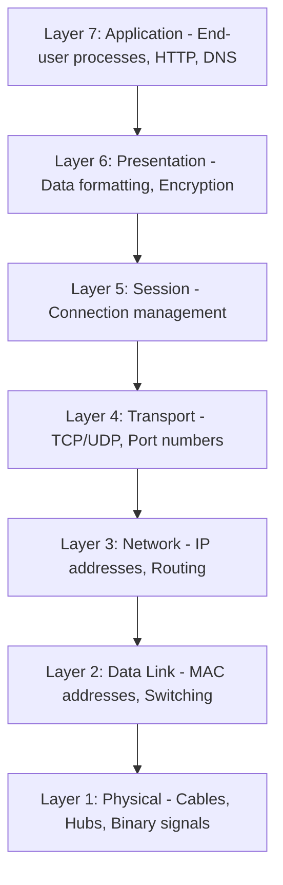
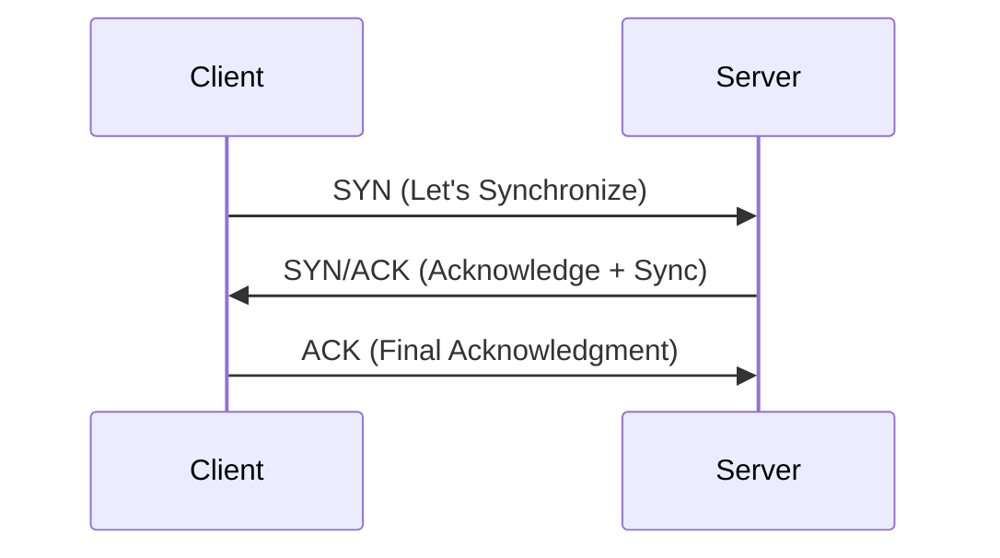

# 02 - Network Fundamentals

Networking is the backbone of cybersecurity. To defend a system, you must understand how data travels between devices and how those devices identify each other.

---

## 🌐 The OSI Model
The Open Systems Interconnection (OSI) model is a 7-layer framework that standardizes how different computer systems communicate.

---

## 🆔 Device Identification
### IP Addresses (Layer 3)
A logical, changeable address identifying a host on a network.
* **IPv4**: Uses four octets (e.g., `192.168.1.1`). Facing exhaustion with only ~4.29 billion addresses.
* **IPv6**: Uses 128-bit addresses (e.g., `2001:0db8:...`) to accommodate billions of devices.
* **Public vs. Private**: Private IPs are for local networks; Public IPs are assigned by ISPs for internet communication.

### MAC Addresses (Layer 2)
A physical, permanent address hard-coded into the Network Interface Card (NIC).
* **Format**: Twelve-character hex (e.g., `a4:c3:f0:85:ac:2d`).
* **MAC Spoofing**: A technique used by attackers to impersonate a trusted device.

---

## 🤝 TCP vs. UDP (Layer 4)

| Feature | TCP (Transmission Control Protocol) | UDP (User Datagram Protocol) |
| :--- | :--- | :--- |
| **Reliability** | High (Guaranteed delivery) | Low (Best effort) |
| **Speed** | Slower (Overhead from handshake) | Much Faster |
| **Method** | Connection-based | Connectionless |
| **Use Case** | Web browsing, Email, File transfer | Video streaming, VoIP, DNS queries |

### The TCP Three-Way Handshake
Before data flows via TCP, a connection must be established:

---

## 🛠️ Network Hardware & Topologies
* **Router**: Connects different networks (Layer 3).
* **Switch**: Connects devices within a single network (Layer 2).
* **VLAN**: Virtually segments a physical network for improved security.
* **Star Topology**: Most common modern design; all devices connect to a central switch. Highly scalable but has a single point of failure (the switch).

---

## 🔍 Critical Network Protocols
* **ARP (Address Resolution Protocol)**: Maps a known IP address to a MAC address.
* **DHCP (Dynamic Host Configuration Protocol)**: Automatically assigns IP addresses via the DORA process (Discover, Offer, Request, ACK).
* **ICMP (Ping)**: Used to test network connectivity and response time.

---

## 🔗 Original Resources
* [THM Room: What is Networking?](https://tryhackme.com/room/whatisnetworking)
* [THM Room: Intro to LAN](https://tryhackme.com/room/introtolan)
* [THM Room: OSI Model](https://tryhackme.com/room/osimodel)
* [THM Room: Packets & Frames](https://tryhackme.com/room/packetsframes)

---
*Next Module: [How The Web Works](./03-how-the-web-works.md)*